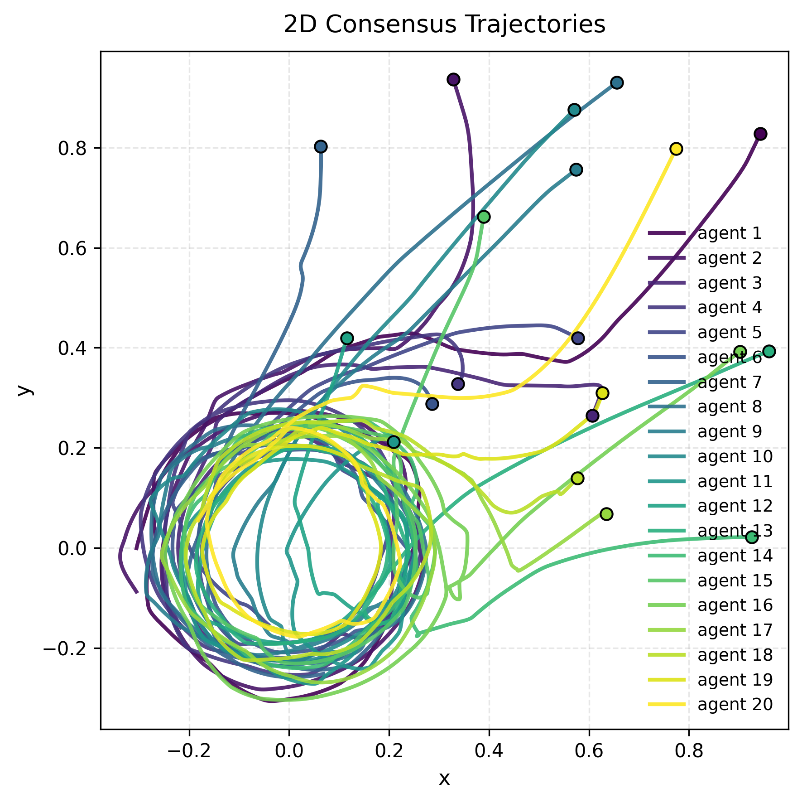

# sniff
[](https://github.com/iqsnider/sniff/actions/workflows/pytest.yml)
[](https://codecov.io/gh/iqsnider/sniff)

Consensus protocol for a random graph of agents perturbed with Gaussian Orthogonal Ensemble (GOE) noise.

## Overview

### Adjacency Matrix
An Erdos–Renyi graph is used to make random undirected connections between network nodes. A connection is formed between nodes only if the probability threshold is satisfied. The basic graph is defined as follows,

$$
U = (U_{ij})_{i,j=1}^n, \quad \text{where } U_{ij} \stackrel{\text{i.i.d.}}{\sim} \text{Unif}[0, 1)
$$

A Bernoulli random matrix is then formed by selecting a matrix of ones conditional upon a connection probability $p$,

$$
B = \mathbf{1}[U < p] \in \\{0,1\\}^{n \times n}, \quad 
\text{with } 
B_{ij} =
\begin{cases}
1, & U_{ij} < p \\
0, & U_{ij} \ge p
\end{cases}
$$

To ensure that the matrix is undirected, we first keep only the strict upper-triangular section of $B$ by forming a matrix $C$ such that,

$$
C_{ij} =
\begin{cases}
B_{ij}, & i < j \\
0, & i \ge j
\end{cases}
$$

Then, the final undirected (and symmetric) adjacency matrix $A$ is formed by summing $C$ and its transpose,

$$
A = C + C^\mathsf{T}
$$


### Graph Laplacian
An adjacency matrix produced from an Erdos-Renyi graph will include undirected connections between nodes depending on a threshold probability. Some nodes will have more connections than others, so the graph Laplacian is used to model the difference in the communication of some nodes in relation to others. A graph Laplacian $L$ is produced from the difference of the degree matrix $D$ and the adjacency matrix $A$,

$$
L = D - A \quad \text{where } D = \text{diag}(d_1, d_2, ..., d_n) \quad \text{and } d_i = \sum_{j=1}^n A_{ij}
$$

The communication pressure modeled by the graph Laplacian will drive each node to the average state of its neighbors. So for some graph Laplacian $L$ and states $\mathbf{x}$ we produce the following consensus dynamics,

$$
\dot{\mathbf{x}} = -L \mathbf{x}
$$

### Setpoint Tracking
For tracking a setpoint, each agent is represent by a position $p_i \in \mathbb{R}^n$. The fully stacked state vector for the system is then $\mathbf{p} = [p_1, p_2, ..., p_N]^\intercal \in \mathbb{R}^{N \times n}$. The system dynamics are then augmented to model the competing attraction to the setpoint and consensus coupling. For some setpoint $p_\text{track}$, the competing dynamics are modeled as an affine linear system,

$$
\dot{\mathbf{p}} = -\alpha(L \otimes I_n)\mathbf{p} - \beta(I_N \otimes I_n)\mathbf{p} + \beta(\mathbf{1}_N \otimes p_\text{track})
$$

where $\alpha$ is the consensus coupling strength, $\beta$ is the setpoint tracking strength, and $\otimes$ is the Kronecker product.

### Injecting Communication Noise
Communication noise between agents by adding a noise term to the graph Laplacian. The system matrix of the consensus dynamics then becomes,

$$
L_\text{noisy} = L + \epsilon W
$$

where $W$ is the matrix term representing the noise between communicating agents and $\epsilon$ is the noise strength.

### Gaussian Orthogonal Ensemble
Many types of noise can be applied to the consensus system. However, if we wish to conduct a tractable spectral analysis, an ensemble derived from Random Matrix Theory can provide a structured spectrum. The Gaussian Orthogonal Ensemble (GOE) has real and symmetric entries drawn from a Gaussian. Perturbing the graph Laplacian with a GOE ensures that the noisy Laplacian remains diagonalizable with real eigenvalues. The GOE matrix is constructed from an $n \times n$ $Z$ matrix with i.i.d. standard normal entries. The matrix $Z$ is then symmetrized,

$$
W = \frac{1}{2}(Z + Z^\intercal)
$$

The canonical GOE used in spectral analysis requires the diagonal elements to have a variance of 1 and the off-diagonal elements to have a variance of 2. The resulting matrix then obeys the Wigner Semicircle Law, that is,

$$
W_{ij} = W_{ji} \sim \mathcal{N}(0,1), \quad \text{for } i \neq j \quad \text{and } W_{ii} \sim \mathcal{N}(0,2)
$$

The GOE noise can then be applied to the Laplacian producing the previously discussed perturbed system.

### Formations
We can embed a structured outcome directly into the concensus protocol. A relative geometric arrangement can be encoded in the system by assigning each agent an offset vector $d_i \in \mathbb{R}^n$. The desired offset matrix is then, $D = [d_1, d_2, ..., d_N]^\intercal \in \mathbb{R}^{N \times n}$. The absolute formation is then a combination of the formation and the setpoint $D + (\mathbf{1}_N \otimes p_{\text{track}})$
. The combined affine system with formation and setpoint tracking is then,

$$
\dot{\mathbf{p}} = -\alpha(L \otimes I_n)\mathbf{p} - \beta(I_N \otimes I_n)\mathbf{p} + \alpha (L \otimes I_n)D + \beta(\mathbf{1}_N \otimes p_\text{track})
$$

## Installation (with uv)

`sniff` uses [uv](https://github.com/astral-sh/uv), a fast Python package manager and environment builder.
You **don’t** need to manually activate virtual environments.

### 1. Clone the repository
```bash
git clone git@github.com:iqsnider/sniff.git
cd sniff
````

### 2. Install dependencies and sync environment

```bash
uv sync
```

---

## Usage

Run simulations directly with `uv run`. All CLI commands have default values.

### Basic example

```bash
uv run sniff protocol-1d
```
<p align="center">
  
  <br>
  <em>Figure 1: Consensus Protocol for noisy 1D agents.</em>
</p>

### Running simple 2D setpoint tracking
```bash
uv run sniff protocol-2d --n 20 --p-track 0.0 0.0
```

<p align="center">
  
  <br>
  <em>Figure 2: Consensus Protocol for noisy 2D agents tracking a setpoint.</em>
</p>

### Running grid formation consensus
```bash
uv run sniff formation --n 20 --p-track 0.0 0.0
```

<p align="center">
  
  <br>
  <em>Figure 3: Consensus Protocol for noisy 2D agents forming a grid.</em>
</p>

### Running dynamic circle consensus
```bash
uv run sniff circle --n 20 --link 0.5 --alpha 0.1 --noise-strength 1
```

<p align="center">
  
  <br>
  <em>Figure 4: Consensus Protocol for noisy 2D agents tracking a circle.</em>
</p>
