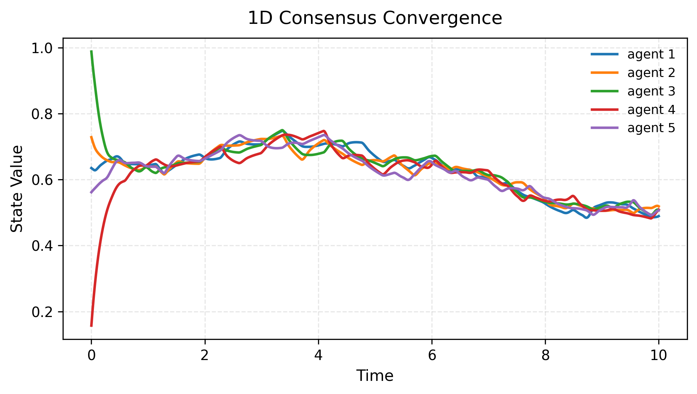
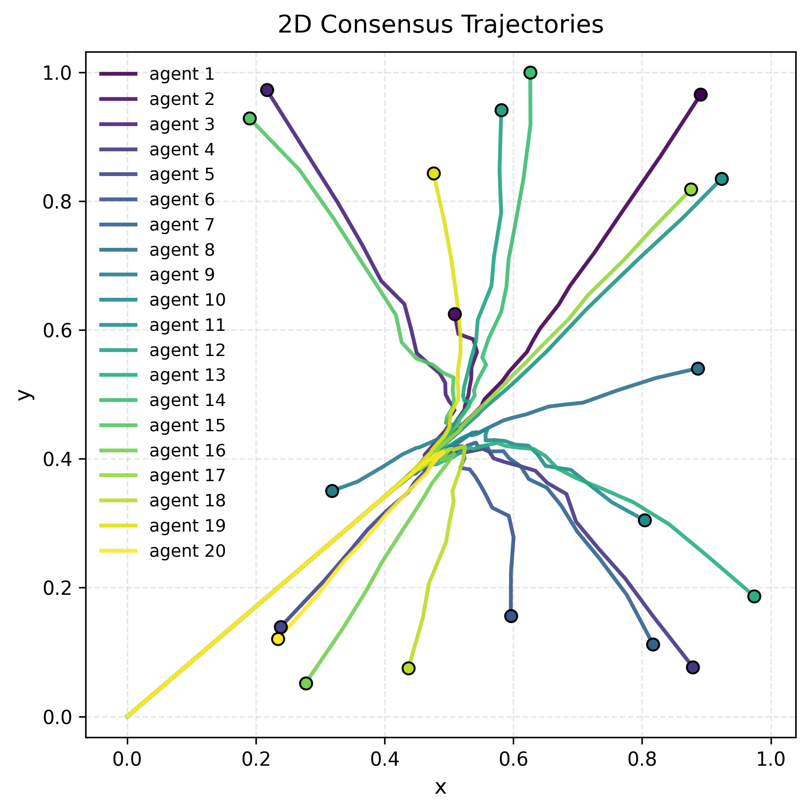
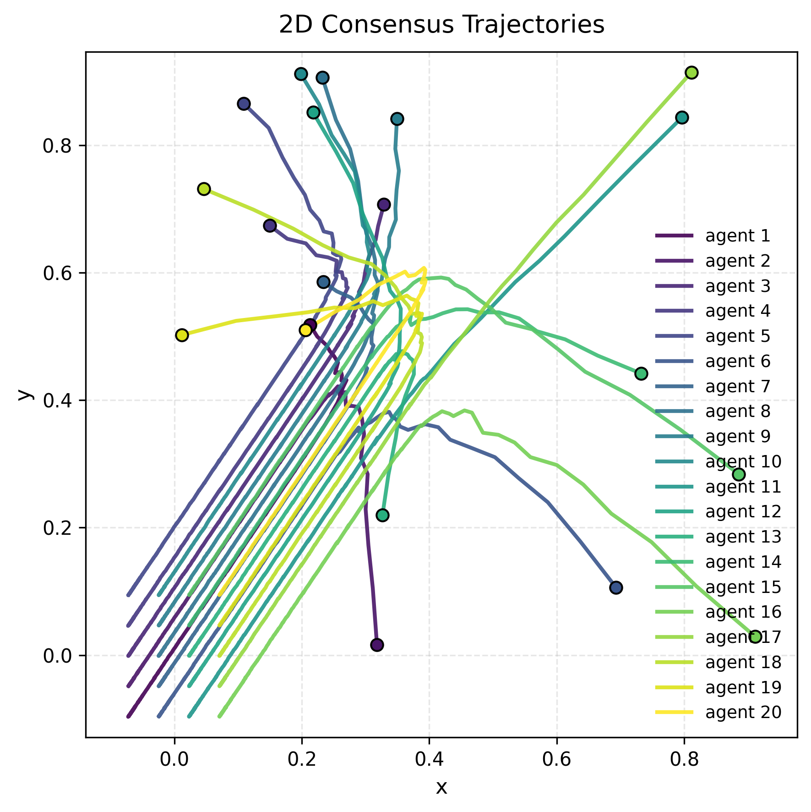
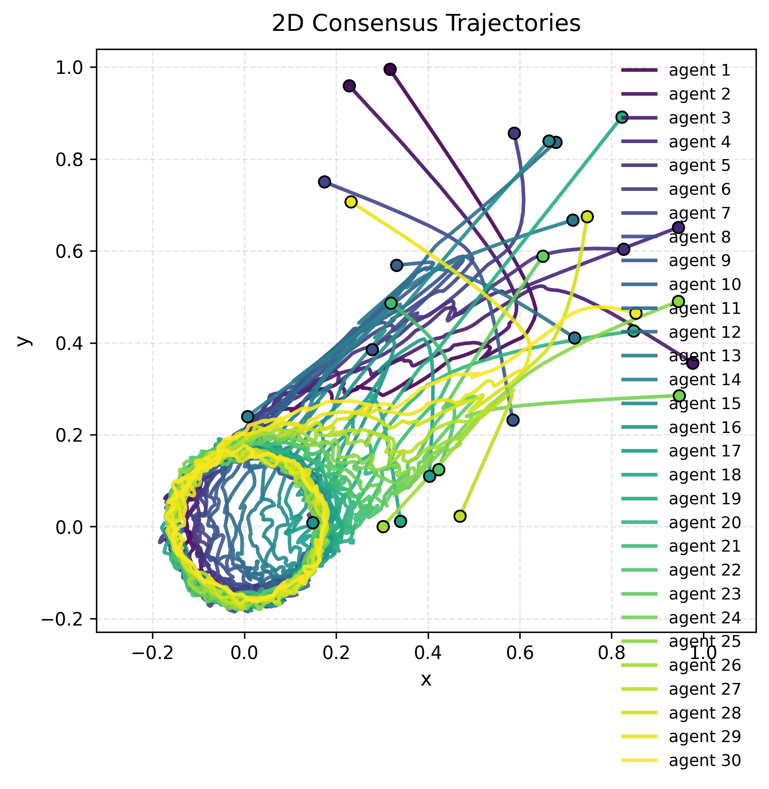

# sniff
[](https://github.com/iqsnider/sniff/actions/workflows/pytest.yml)
[](https://codecov.io/gh/iqsnider/sniff)

Consensus protocol for a random graph of agents perturbed with Gaussian Orthogonal Ensemble (GOE) noise.

---

## Overview

## Installation (with uv)

`sniff` uses [uv](https://github.com/astral-sh/uv), a fast Python package manager and environment builder.  
You **don’t** need to manually activate virtual environments.

### 1. Clone the repository
```bash
git clone git@github.com:iqsnider/sniff.git
cd sniff
````

### 2. Install dependencies and sync environment

```bash
uv sync
```

---

## Usage

Run simulations directly with `uv run`. All CLI commands have default values.

### Basic example

```bash
uv run sniff protocol-1d
```
<p align="center">
  
  <br>
  <em>Figure 1: Consensus Protocol for noisy 1D agents.</em>
</p>

### Running simple 2D setpoint tracking
```bash
uv run sniff protocol-2d --n 20 --p-track 0.0 0.0
```

<p align="center">
  
  <br>
  <em>Figure 2: Consensus Protocol for noisy 2D agents tracking a setpoint.</em>
</p>

### Running grid formation consensus
```bash
uv run sniff formation --n 20 --p-track 0.0 0.0
```

<p align="center">
  
  <br>
  <em>Figure 3: Consensus Protocol for noisy 2D agents forming a grid.</em>
</p>

### Running dynamic circle consensus
```bash
uv run sniff circle --n 30
```

<p align="center">
  
  <br>
  <em>Figure 4: Consensus Protocol for noisy 2D agents tracking a circle.</em>
</p>
